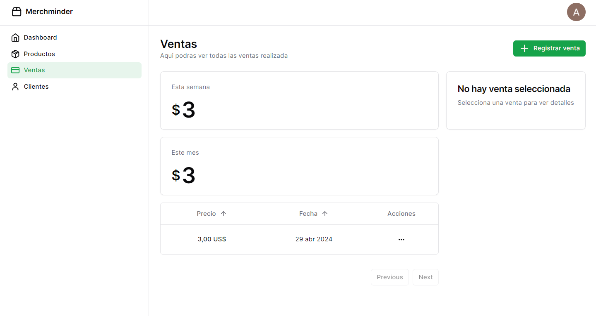

import { Aside } from "@astrojs/starlight/components";
import { Steps } from "@astrojs/starlight/components";

En este tutorial aprenderás a utilizar Merchminder para llevar un mejor control de tu negocio. Abordaremos los aspectos fundamentales de la aplicación y te guiaremos paso a paso para que puedas comenzar a utilizarla de inmediato.

Antes de empezar, asegúrate de haber creado una cuenta en nuestra página web. Si aún no lo has hecho, puedes hacerlo [aquí](https://merchminder-app-apps.vercel.app/auth/login).

Una vez iniciado sesion en Merchminder, podrás comenzar a utilizar la aplicación. A continuación, te mostramos los pasos que debes seguir para comenzar a utilizar Merchminder.

<Aside type="tip">
  Durante el tutorial no se hara tanto enfasis en los comportamientos de la
  aplicacion ya sea la relacion entre los productos y las ventas, o la relacion
  entre los clientes y las ventas. Por lo tanto se recomienda que ante cualquier
  duda se recurra a la seccion especifica del apartado.
</Aside>

## Primeros pasos

El **Dashboard** es la página principal de Merchminder. En esta página podrás ver un resumen de tus productos, ventas y clientes. Además, podrás acceder a las diferentes secciones de la aplicación desde el menú de navegación y en la parte superior derecha de la página podrás ver tu nombre de usuario y la opción de cerrar sesión.

### Creando un producto

Para crear un producto, sigue los siguientes pasos:

<Steps>

1.  Haz clic en la opción **Productos** en el menú de navegación. Se abrirá una nueva página con una lista de tus productos.

    

2.  Haz clic en el botón **Agregar producto**. Se abrirá un formulario en el que podrás ingresar la información de tu producto, como el nombre, la descripción y el precio.

3.  Ingresa la información de tu producto y haz clic en el botón **Guardar**. Tu producto se agregará a la lista de productos.

    

4.  Si nuevamente haces clic en la opción **Productos** en el menú de navegación, podrás ver tu nuevo producto en la lista.

    

</Steps>

Siguiendo estos pasos, ya creaste tu primer producto en Merchminder. Ahora avancemos al principal apartado que contiene la aplicacion, las ventas y los clientes.

### Agendando un cliente

Para agendar un cliente, sigue los siguientes pasos:

<Steps>

1.  Haz clic en la opción **Clientes** en el menú de navegación. Se abrirá una nueva página con una lista de tus clientes.

    

2.  Haz clic en el botón **Crear cliente**. Se abrirá un formulario en el que podrás ingresar la información de tu cliente, como el nombre, el correo electrónico y el teléfono.

3.  Ingresa la información de tu cliente y haz clic en el botón **Crear cliente**. Tu cliente se agregará a la lista de clientes.

    

4.  Si nuevamente haces clic en la opción

        **Clientes** en el menú de navegación, podrás ver tu nuevo cliente en la lista.

        

</Steps>

Siguiendo estos pasos, ya agendaste tu primer cliente en Merchminder. Ahora avancemos al siguiente apartado, las ventas.

Las ventas es un apartado fundamental, ya que en este se registran todas las transacciones que se realizan en tu negocio. Sin embargo, para poder registrar una venta, primero debes tener productos y clientes registrados en la aplicación.

### Registrando una venta

Para registrar una venta, sigue los siguientes pasos:

<Steps>

1.  Haz clic en la opción **Ventas** en el menú de navegación. Se abrirá una nueva página con una lista de tus ventas.

    

2.  Haz clic en el botón **Registrar venta**. Se abrirá un formulario en el que podrás seleccionar el cliente al que le estás vendiendo y los productos que estás vendiendo.

3.  Selecciona el cliente y los productos que estás vendiendo y haz clic en el botón **Registrar venta**. Tu venta se agregará a la lista de ventas.

    

4.  Si nuevamente haces clic en la opción

        **Ventas** en el menú de navegación, podrás ver tu nueva venta en la lista.

        

</Steps>

Siguiendo estos pasos, ya registraste tu primera venta en Merchminder. Ahora que has aprendido a crear productos, agendar clientes y registrar ventas, puedes explorar las demás funcionalidades de la aplicación y comenzar a llevar un mejor control de tu negocio.

<Aside type="tip">
  Si tienes alguna duda o problema, no dudes en contactarnos a través de nuestro correo electrónico o nuestras redes sociales.
</Aside>
